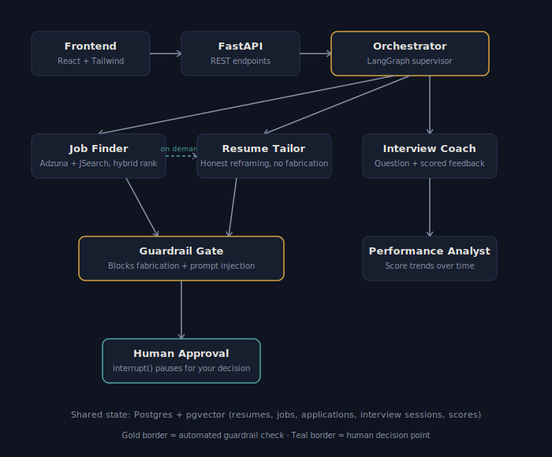

# Career Copilot

A multi-agent AI system that finds real job postings, tailors your resume honestly for a specific role, runs mock interview practice with scored feedback, and tracks your improvement over time — built end-to-end as a fresher's portfolio project, not a tutorial clone.

**Live demo:** [frontend](https://career-copilot-frontend-82uu.onrender.com) · [API docs](https://career-copilot-api-cg9h.onrender.com/docs)

*(The demo backend runs on Render's free tier, so the first request after a period of inactivity may take ~30 seconds to wake up.)*

## Architecture



The system is a **LangGraph orchestrator** coordinating four specialized agents, with a formal guardrail checkpoint and a genuine human-in-the-loop pause before anything is treated as "ready to apply."

- **Job Finder** — queries Adzuna and JSearch (which itself legitimately aggregates LinkedIn, Indeed, and Glassdoor postings), embeds your profile and each job description locally, and ranks results with a hybrid score: `0.7 × semantic similarity + 0.3 × keyword overlap`, plus a hard filter that drops any job with zero real skill overlap regardless of how similar its tone reads.
- **Resume Tailor** — reframes your real skills/projects for a specific job, on demand. Explicitly instructed (and separately guardrail-checked, not just prompted) to never fabricate seniority, years of experience, or achievements you haven't actually claimed.
- **Interview Coach** — generates a role-specific question, scores your answer on technical and communication axes, and gives specific, concrete feedback rather than generic encouragement.
- **Performance Analyst** — aggregates every scored session into trend data over time.
- **Guardrail Gate** — a real, deterministic code check (not just a prompt instruction) that runs after Job Finder (checking external job text for prompt-injection attempts) and after Resume Tailor (checking for fabricated-experience language) before either result is ever saved.
- **Human Approval** — implemented with LangGraph's `interrupt()`/`Command(resume=...)`, genuinely pausing execution mid-graph until you approve or reject. Nothing is auto-submitted anywhere; approval marks intent, and the real job posting link is always surfaced for you to apply yourself.

## Why it doesn't auto-apply on LinkedIn/Naukri/Internshala

None of these platforms offer a real API for individual developers. The only way to pull data directly from them is scraping, which violates their terms of service and risks account bans — so this project deliberately doesn't do it. Adzuna and JSearch are used instead: both are licensed, ToS-compliant aggregators, and JSearch specifically already surfaces real LinkedIn and Indeed postings through proper channels.

## Tech stack

| Layer | Choice | Why |
|---|---|---|
| Orchestration | LangGraph | Native support for stateful, multi-agent graphs and human-in-the-loop `interrupt()` |
| LLM | Claude Haiku 4.5 (primary) / Gemini 2.5 Flash (fallback) | Cheap, fast, sufficient for this workload; Gemini used where billing setup was a blocker |
| Embeddings | fastembed (ONNX, local, 384-dim) | Free, no API cost, and light enough to fit a 512MB free-tier deployment — swapped in after `sentence-transformers`' PyTorch dependency caused out-of-memory crashes on deploy |
| Database | PostgreSQL + pgvector | Relational data (jobs, applications, sessions) and semantic search in one database |
| Migrations | Alembic | Versioned, reviewable schema changes |
| Backend | FastAPI + SQLAlchemy 2.0 | Async-capable API layer, typed ORM |
| Frontend | React + Vite + Tailwind | Fast dev loop, no heavier framework needed for this scope |
| Job sourcing | Adzuna API + JSearch (RapidAPI) | Free tiers, real listings, no ToS risk |
| Deployment | Render | Free web service + free static hosting + managed Postgres with pgvector support |

## Honest limitations

- **Render's free Postgres is temporary** and expires periodically — fine for demoing, would need a small paid tier for real long-term persistence.
- **Gemini's free tier has variable latency** and occasionally returns a transient 503 under load; retrying resolves it.
- **Guardrail checks are keyword-based**, not exhaustive — they catch the specific fabrication and injection patterns tested against, not every conceivable phrasing.
- **Resume/skills/location filters compose into a single search string** rather than using each job API's own dedicated filter parameters, since those weren't verified against live docs during development.

## Running it locally

```bash
# Backend
git clone <this-repo>
cd career-copilot
python -m venv venv && venv\Scripts\activate  # or source venv/bin/activate on Mac/Linux
pip install -r requirements.txt
cp .env.example .env  # fill in your real API keys
docker compose up -d  # Postgres + pgvector + Adminer
alembic upgrade head
uvicorn app.main:api --reload

# Frontend, in a separate terminal
cd career-copilot-frontend
npm install
npm run dev
```

## Tests

```bash
python -m pytest tests/ -v
```

11 tests covering the hybrid matching math (cosine similarity edge cases) and the guardrail policies (fabrication and prompt-injection detection).
